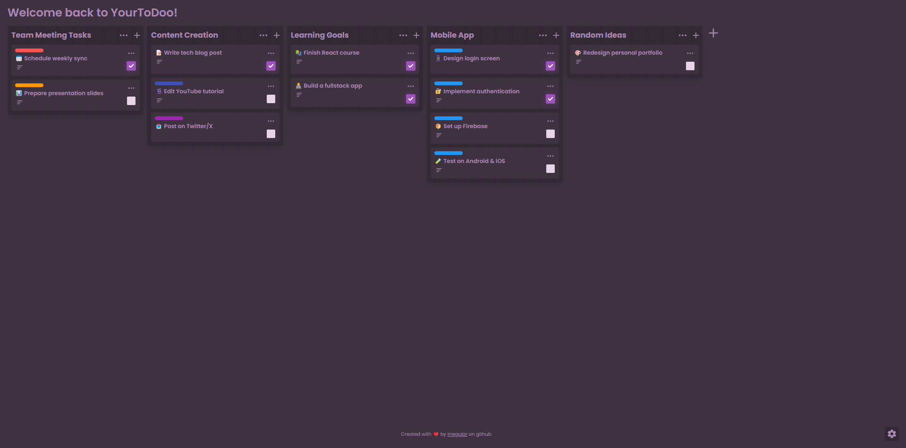

# YourToDoo

A modern and elegant task management application built with React and Tailwind CSS.

🌐 **Live Demo:** [yourtodoo.onrender.com](https://yourtodoo.onrender.com/)
📦 **Repository:** [github.com/Irregulaar/To-Do](https://github.com/Irregulaar/To-Do)



## ✨ Features

- 📝 Multiple task boards support
- 🎨 Customizable task colors
- ✅ Task completion tracking
- 📋 Task descriptions
- 💾 Local storage persistence
- 🎯 Clean and intuitive interface
- 📱 Responsive design

## 🛠️ Built With

- React 19
- Tailwind CSS
- Vite
- React Icons
- Local Storage API

## 🚀 Getting Started

### Prerequisites

- Node.js (v18 or higher)
- npm, pnpm or yarn

### Installation

1. Clone the repository

```bash
git clone https://github.com/Irregulaar/To-Do.git
```
